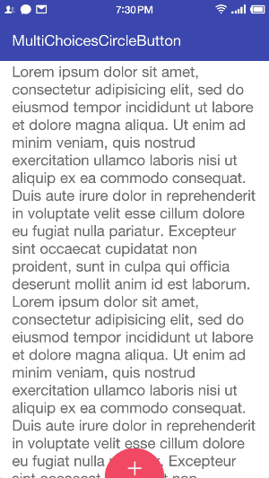

# MultiChoicesCircleButton

A multiple-choice button with 3D parallax effect.

Inspired by [Nicola Felasquez Felaco's Pubbblish](https://dribbble.com/shots/2293573-Pubbblish) and refer to [JustinFincher/JZMultiChoicesCircleButton](https://github.com/JustinFincher/JZMultiChoicesCircleButton) .

## ScreenShot



## Include MultiChoicesCircleButton to Your Project
With gradle:

```groovy
dependencies {
   compile 'com.gjiazhe:MultiChoicesCircleButton:1.0'
}
```

## Use MultiChoicesCircleButton in Layout File
```xml
<com.gjiazhe.multichoicescirclebutton.MultiChoicesCircleButton
    android:id="@+id/multiChoicesCircleButton"
    android:layout_width="match_parent"
    android:layout_height="match_parent"
    app:mccb_collapseRadius="40dp"
    app:mccb_expandRadius="120dp"
    app:mccb_icon="@drawable/plus"
    app:mccb_text="Choose"
    app:mccb_buttonColor="@color/colorAccent"
    app:layout_behavior="@string/multi_choices_circle_button_behavior"/>
```
All attributes:

|         Attributes         |  Format   |       Default        |               Description                |
| :------------------------: | :-------: | :------------------: | :--------------------------------------: |
|         mccb_icon          | drawable  |         null         |         The icon of the button.          |
|    mccb_enableParallax     |  boolean  |         true         |    Enable 3D parallax effect or not.     |
|    mccb_collapseRadius     | dimension |         40dp         | The radius of the button when it is collapsed. |
|     mccb_expandRadius      | dimension |        120dp         | The radius of the button when it is expanded. |
|         mccb_text          |  string   |         null         |        The tittle of the button.         |
|       mccb_textSize        |  string   |         35sp         |       The text size of the button.       |
|       mccb_textColor       |   color   |        white         |      The text color of the button.       |
|      mccb_buttonColor      |   color   |       \#FC516A       |         The color of the button.         |
|       mccb_duration        |  integer  |        200ms         |           Animation duration.            |
|      mccb_itemRadius       | dimension |         20dp         |           The radius of items.           |
| mccb_itemDistanceToCentre  | dimension | expandRadius * 2 / 3 | The distance from items' centre to button's centre. |
|  mccb_itemBackgroundColor  |   color   |        white         |      The background color of items.      |
| mccb_showBackgroundShadow  |  boolean  |         true         | Whether show shadow when hold the button. |
| mccb_backgroundShadowColor |   color   |      \#bb757575      | The shadow's color when hold the button. |


## Set Items

Construct the item with its __title__, __icon__ and __angle__.

```java
MultiChoicesCircleButton.Item item1 = new MultiChoicesCircleButton.Item("Like", getResources().getDrawable(R.drawable.icon1), 30);

MultiChoicesCircleButton.Item item2 = new MultiChoicesCircleButton.Item("Message", getResources().getDrawable(R.drawable.icon2), 90);

MultiChoicesCircleButton.Item item3 = new MultiChoicesCircleButton.Item("Tag", getResources().getDrawable(R.drawable.icon3), 150);

List<MultiChoicesCircleButton.Item> buttonItems = new ArrayList<>();
buttonItems.add(item1);
buttonItems.add(item2);
buttonItems.add(item3);

MultiChoicesCircleButton multiChoicesCircleButton = (MultiChoicesCircleButton) findViewById(R.id.multiChoicesCircleButton);
multiChoicesCircleButton.setButtonItems(buttonItems);
```

## Set OnSelectedItemListener and OnHoverItemListener

```java
multiChoicesCircleButton.setOnSelectedItemListener(new MultiChoicesCircleButton.OnSelectedItemListener() {
    @Override
    public void onSelected(MultiChoicesCircleButton.Item item, int index) {
        // Do something
    }
});

multiChoicesCircleButton.setOnHoverItemListener(new MultiChoicesCircleButton.OnHoverItemListener(){
    @Override
    public void onHovered(MultiChoicesCircleButton.Item item, int index) {
        // Do something
    }
});
```

## Wrok with CoordinatorLayout to enable auto hide/show when scrolling

```xml
<com.gjiazhe.multichoicescirclebutton.MultiChoicesCircleButton
    ....
    app:layout_behavior="@string/multi_choices_circle_button_behavior"/>
```


## License

    MIT License

    Copyright (c) 2016 郭佳哲

    Permission is hereby granted, free of charge, to any person obtaining a copy
    of this software and associated documentation files (the "Software"), to deal
    in the Software without restriction, including without limitation the rights
    to use, copy, modify, merge, publish, distribute, sublicense, and/or sell
    copies of the Software, and to permit persons to whom the Software is
    furnished to do so, subject to the following conditions:
    
    The above copyright notice and this permission notice shall be included in all
    copies or substantial portions of the Software.
    
    THE SOFTWARE IS PROVIDED "AS IS", WITHOUT WARRANTY OF ANY KIND, EXPRESS OR
    IMPLIED, INCLUDING BUT NOT LIMITED TO THE WARRANTIES OF MERCHANTABILITY,
    FITNESS FOR A PARTICULAR PURPOSE AND NONINFRINGEMENT. IN NO EVENT SHALL THE
    AUTHORS OR COPYRIGHT HOLDERS BE LIABLE FOR ANY CLAIM, DAMAGES OR OTHER
    LIABILITY, WHETHER IN AN ACTION OF CONTRACT, TORT OR OTHERWISE, ARISING FROM,
    OUT OF OR IN CONNECTION WITH THE SOFTWARE OR THE USE OR OTHER DEALINGS IN THE
    SOFTWARE.

